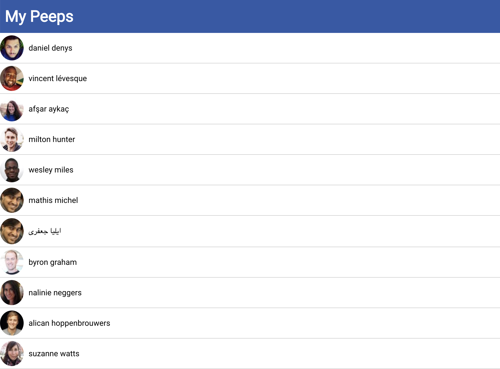

# React Contact List 

## Challenges I Faced?

I had difficulty understanding how and when to route react components.

## How Did I Over Come Those Challenges? 

I collaborated with my peers to better understand different ways to approach this problem. Once I had a general idea of how to complete the task I turn to platforms like Google, YouTube, MDN docs, Stackoverflow, GitHub, online courses, bootcamps and reference guides to double check what I was learning and by doing so I was able to find the proper JavaScript methods and functions needed to finish the task and I programmed the contact list accordingly.

## What Did I Learn? 

* Received a deeper understanding on the basics of React
* How to use browser router to manipulate the dom 
* How to import a Google fonts into a react application
* How to map through the data in a Json file and render it within a React application
* Received a deeper understanding on React Hooks 
* How to test a react application by using the terminal and Yarn commands
* How to link stylesheets in a react application

## Contact List - List View

## Contact List - Single View

